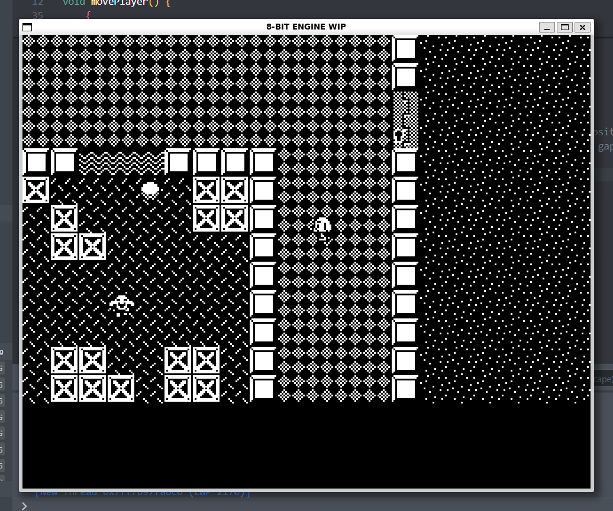

C draft base for an 8-bit dungeon crawler. I've designed this to be (hopefully) straightforward to rewrite in assembly for actual 8-bit machines. The rendering code in this is targeting the Acorn computers from the early 80's, which use a flat memory model and the framebuffer is in system ram (between [0x5800-0x7FFF] for the monochrome mode I'm using). I'm using a uint8_t[0x8000] array to simulate the memory, then dumping the framebuffer out to a window canvas via SDL but graphics are otherwise done in software using masks and shifts. This is still very much WIP but basic rendering functions are done for now. Assets/graphics were sourced from various 1-bit tilepacks on itch dot io. Test levels were made in Tiled, exported in CSV then compressed and bitpacked to 5-bits using a separate compressor I have written that also changes the tileIDs to fit in the range [0-31], and they are decompressed as needed. Work is otherwise my own except where noted.

